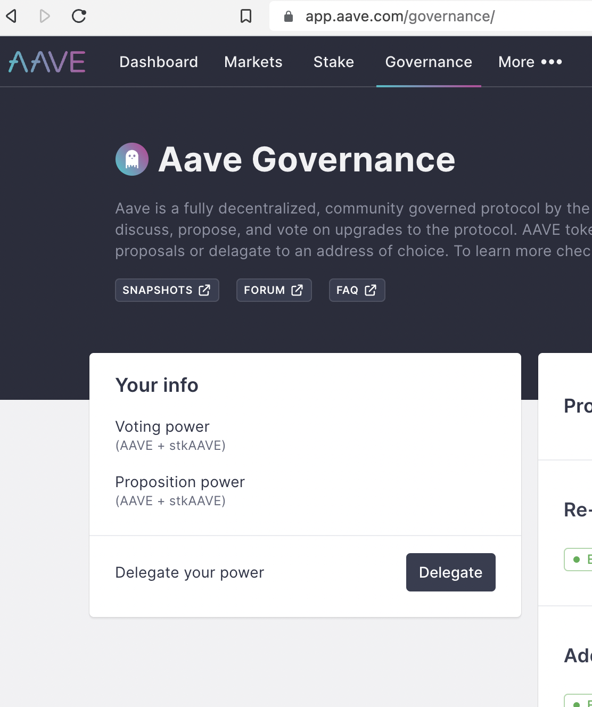
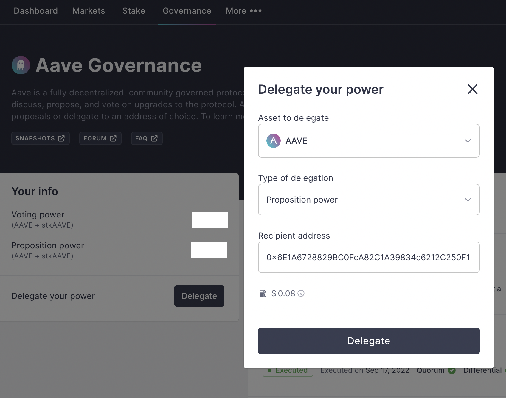
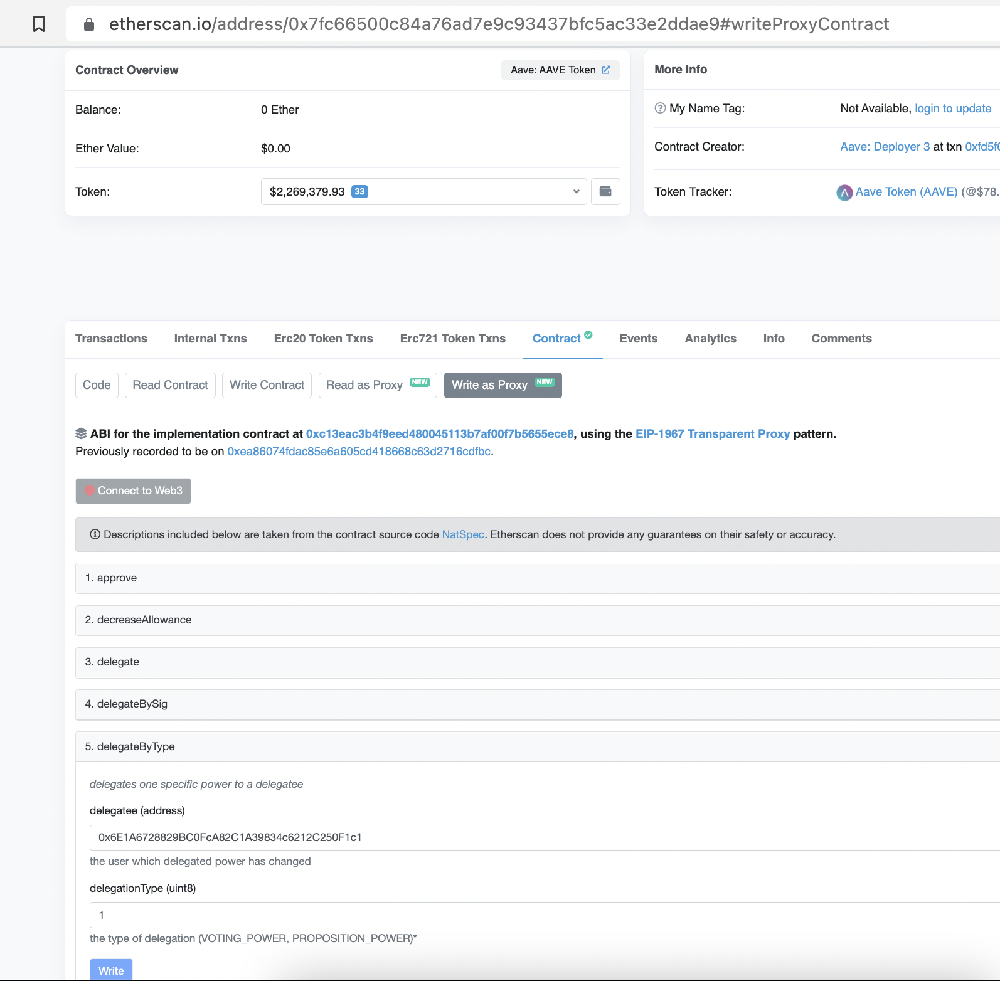

# How to delegate AAVE (and stkAAVE)

 

## Delegation key points

- **There are 2 types of power: voting and proposition**. Therefore, there are 2 types of delegation.
- **Both delegations are completely independent**; you can delegate your voting power to an address, while you delegate your proposition power to another address.
- **Delegation is splitted by token (AAVE/stkAAVE)**, totalling 4 types at the moment, completely independent: voting and proposition powers of AAVE; voting and proposition power of stkAAVE.
- **You can't delegate partially one type of power; you delegate all the power you have (balance) of 1 type of 1 token**. This means that for example, if you have 100 AAVE balance, you can only delegate 100 voting power to address X, not less. Of course, you can delegate at the same time 100 proposition power to another address Y.
- **Your total delegation power of one type is equal to your balance of AAVE + stkAAVE - what you are delegating of that type from both tokens + all delegations of that type others are doing to you**.
- **You can't re-delegate the delegation you are receiving**.
- **To vote on a proposal P, the wallet address from where you want to vote should have voting power (balance or delegation of voting) before the proposal is created**; this is called doing a "snapshot". After the proposal is open to vote, you can freely move your tokens, or give delegation of voting to somebody else, as you will still be able to vote on proposal P, or if you already voted, it will remain valid.
- **Proposition power is required to create a proposal, not to vote**. If you have proposition power and create a proposal (or give proposition delegation to somebody who does it), different to voting, **you MUST keep the proposition power on the wallet that created the proposal during the whole proposal duration**. If the wallet at any point has less proposition than the threshold required for creation, anybody could cancel the proposal.
- **It is possible to delegate both proposition and voting power at the same time to the same recipient, but it is not so recommended**: you give proposition power to somebody that has the ability to propose something; you give delegation to somebody you trust to vote on your behalf.
- **Transferring out tokens from your wallet means that the power (of any type) you have, including what you are delegated, will be reduced by the amount transferred out**.

 

## How to delegate?

To give any type of delegation to some address, you need to interact with the source of the power, so the AAVE token or the stkAAVE token.

 

**AAVE** [https://etherscan.io/token/0x7fc66500c84a76ad7e9c93437bfc5ac33e2ddae9](https://etherscan.io/token/0x7fc66500c84a76ad7e9c93437bfc5ac33e2ddae9)

**stkAAVE**: [https://etherscan.io/address/0x4da27a545c0c5b758a6ba100e3a049001de870f5](https://etherscan.io/address/0x4da27a545c0c5b758a6ba100e3a049001de870f5)

 

The function to call on each token to delegate a type of power is:

 

`delegateByType(theAddressYouWantToDelegateTo, powerTypeIdentifier)`

 

- `powerTypeIdentifier` being `0` for VOTING and `1` for PROPOSITION.

- If you want to un-delegate, you call the same function, passing your own address as `theAddressYouWantToDelegateTo`.

 
 

----

 

### Delegate via the Aave IPFS UI

 

One option to give delegation is to do it via [app.aave.com](app.aave.com)

 

*Main panel for delegation on the Aave ipfs UI*

 

*Delegation popup, with dropdowns for token selection (AAVE/stkAAVE) and power type*

 

----

 

### Delegate via Etherscan

 

Another option is to interact with the AAVE and stkAAVE tokens via Etherscan, and call the `delegateByType()` function.

 

*Giving proposition delegation via delegateByType() on Etherscan*